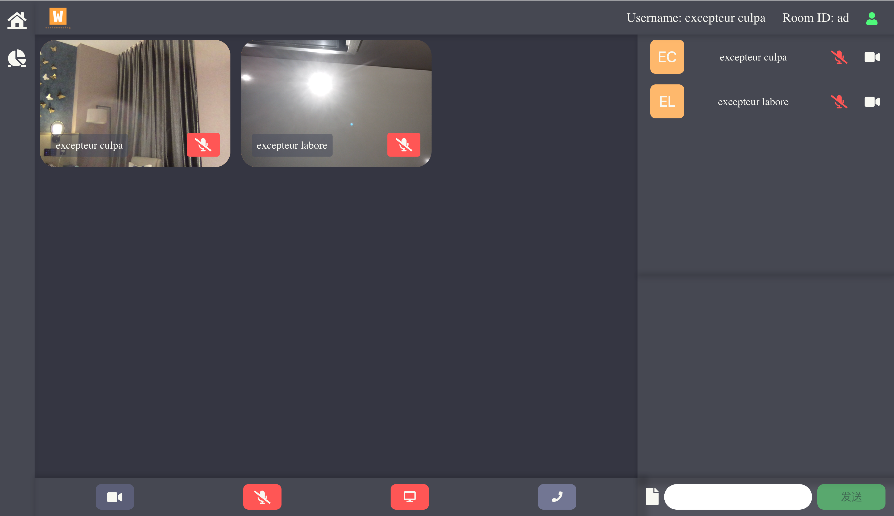

# WorldMeeting

A multi-user real-time audio and video communication application based on WebRTC.



## Features

- Join/leave room
- Call with video/audio
- Send messages/files

## Local deployment

Frontend:

```bash
yarn
cd frontend
yarn
yarn dev
```

Then open: https://localhost:3000/#/

Backend:

```bash
cd backend
yarn
yarn dev
```

## How it works

- Use native `RTCPeerConnection` to form a [Mesh topology network](https://medium.com/@khan_honney/webrtc-servers-and-multi-party-communication-in-webrtc-6bf3870b15eb#fcf7) in a single room
    - Each client maintains (n - 1) `RTCPeerConnection` to connect with different users in the same room
- Use Socket.IO backend as a signal to help discover different users, passing signals, user updates and messages

## Deploy to Heroku

```bash
heroku create
git push heroku main
heroku ps:scale web=1
heroku open
```

## References

1. https://github.com/vuejs/rfcs/blob/master/active-rfcs/0040-script-setup.md
2. https://socket.io/docs/v4/listening-to-events/
3. https://socket.io/docs/v4/emit-cheatsheet/
4. https://socket.io/docs/v4/client-initialization/
5. https://github.com/webrtc/samples
6. https://webrtc.org/getting-started/firebase-rtc-codelab
7. WebRTC 技术详解, 栗伟
8. WebRTC 音视频实时互动技术——原理、实战与源码分析, 李超
